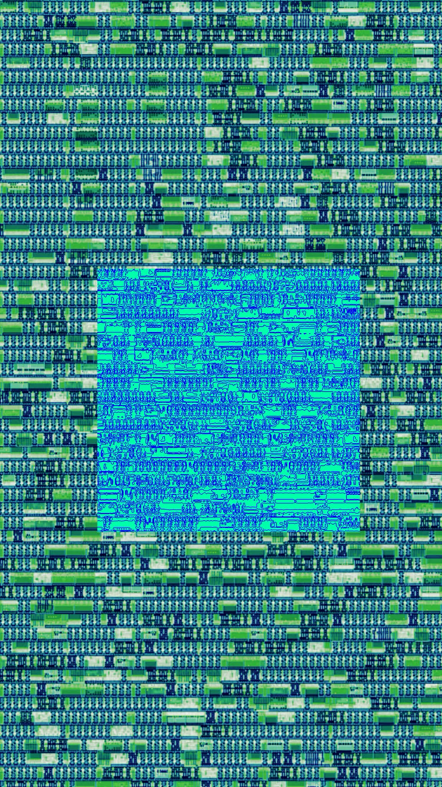

   

# Tiny Tapeout S3FDP Seq+Comb MLIR Flow (`ttsky26a`)

Top module: `tt_um_lledoux_s3fdp_seqcomb`

## Overview

This project implements a compiler-guided arithmetic specialization flow:

1. Detect a structured accumulation loop in MLIR (`scf.for` + `memref.load/store` + `arith.mulf/addf`).
2. Replace generic IEEE float datapath behavior with a specialized S3FDP accumulator.
3. Lower to sequential+combinational hardware with CIRCT and package it for TinyTapeout.

Many workloads include multiply-accumulate loop shapes where full IEEE operator generality is costly. The flow recognizes this loop form and emits a narrower arithmetic circuit tuned for bounded numerical regimes.

## Arithmetic Model

In this flow, S3FDP is used as a truncated Kulisch-like fixed-point accumulation strategy:

- products are formed from input mantissas/exponents,
- accumulation happens in a constrained fixed-point-like internal format,
- final result is re-encoded as `f32`.

This implementation uses:

- `ovf=5`
- `msb=6`
- `lsb=-6`
- `chunk_size=16`

These parameters define the internal truncation and dynamic range budget of the specialized accumulator instance (`s3fdp_accum_core_wE8_wF23_cs16`).

## Compiler Pattern and Workload Context

The input loop that drives subsequent transformations is:

```mlir
scf.for %k = %c0 to %c4 step %c1 {
  %x = memref.load %a[%k] : memref<4xf32>
  %y = memref.load %b[%k] : memref<4xf32>
  %acc = memref.load %c[%c0] : memref<2xf32>
  %m = arith.mulf %x, %y : f32
  %s = arith.addf %acc, %m : f32
  memref.store %s, %c[%c0] : memref<2xf32>
}
```

Source: `flow/mlir/s3fdp_loop_accum.mlir`

This is a minimal dot-product style kernel.
The same loop shape appears as a building block in higher-level programs, including tiled matrix multiplication pipelines generated from ML frameworks such as PyTorch frontends.
This repository keeps a compact deterministic kernel to make it fit in some TinyTapeout tiles.

## Scalability: Llama/Python/torch -> GDS

A full end-to-end path has been tested on llama-style subblocks.
The hardware kernel here is the small fixed-size building block that appears repeatedly inside larger tensor programs.

```python
class LlamaFfnSublayer(nn.Module):
    """Llama FFN sublayer using SwiGLU (SiLU-gated linear unit)."""

    def __init__(self, dim: int = 512, hidden_dim: int | None = None, multiple_of: int = 256):
        super().__init__()
        if hidden_dim is None:
            hidden_dim = 4 * dim
            hidden_dim = int(2 * hidden_dim / 3)
            hidden_dim = multiple_of * ((hidden_dim + multiple_of - 1) // multiple_of)
        self.w_gate = nn.Linear(dim, hidden_dim, bias=False)
        self.w_up = nn.Linear(dim, hidden_dim, bias=False)
        self.w_down = nn.Linear(hidden_dim, dim, bias=False)

    def forward(self, x: torch.Tensor) -> torch.Tensor:
        gate = F.silu(self.w_gate(x))
        up = self.w_up(x)
        return self.w_down(gate * up)
```

High-level MLIR excerpt from this path:

```mlir
...
%8 = linalg.generic
  {ins(%7: tensor<1x2x16xf32>) outs(%5: tensor<1x2x16xf32>) {
    %19 = arith.negf %in : f32
    %20 = math.exp %19 : f32
    %21 = arith.addf %20, %cst_1 : f32
    %22 = arith.divf %cst_1, %21 : f32
    linalg.yield %22 : f32
  }} -> tensor<1x2x16xf32>

%9 = linalg.generic
  {ins(%8, %7: tensor<1x2x16xf32>, tensor<1x2x16xf32>)
   outs(%5: tensor<1x2x16xf32>)} {
    %19 = arith.mulf %in, %in_7 : f32
    linalg.yield %19 : f32
  } -> tensor<1x2x16xf32>
...
```


## What is this Figure ?

A bit of art-chitecture does not hurt: 



## Reproducible Generation Flow

Run:

```sh
./scripts/generate_s3fdp_core.sh
```

Tool locations are environment-driven:

- `EMERAUDE_MLIR_OPT` and `CIRCT_OPT` from env, if set.
- Otherwise, binaries are resolved from `PATH` (`emeraude-mlir-opt`, `circt-opt`).
- Optional root env vars are supported: `EMERAUDE_REPO`, `CIRCT_BIN_DIR`.

Example:

```sh
EMERAUDE_MLIR_OPT="$HOME/tools/emeraude-mlir/build/bin/emeraude-mlir-opt" \
CIRCT_OPT="$HOME/tools/circt/build/bin/circt-opt" \
./scripts/generate_s3fdp_core.sh
```

Additional overrides:
`INPUT_MLIR`, `ARTIFACT_DIR`, `CORE_SV_OUT`, `WRAPPER_SV_IN`, `PROJECT_V_OUT`.

## Internal IR Snapshots

Comb-specialized stage (`generated/ir-stages/20-flopoco-comb.mlir`):

```mlir
func.func @fpmult_loop_muladd_s3fdp(%arg0: i1, %arg1: i1,
    %arg2: memref<4xi32>, %arg3: memref<4xi32>, %arg4: memref<2xi32>) -> i32 {
  %c0 = arith.constant 0 : index
  %c1 = arith.constant 1 : index
  %c4 = arith.constant 4 : index
  scf.for %arg5 = %c0 to %c4 step %c1 {
    %1 = memref.load %arg2[%arg5] : memref<4xi32>
    %2 = memref.load %arg3[%arg5] : memref<4xi32>
    %3 = seq.to_clock %arg0
%s3fdp_accum.r = hw.instance "s3fdp_accum" @s3fdp_accum_core_wE8_wF23_cs16(
  clk: %3: !seq.clock, reset: %arg1: i1, x: %1: i32, y: %2: i32
) -> (r: i32)
    memref.store %s3fdp_accum.r, %arg4[%c0] : memref<2xi32>
  }
  %0 = memref.load %arg4[%c0] : memref<2xi32>
  return %0 : i32
}
```

Seq/HW aggregate stage (`generated/ir-stages/60-hw-aggregate.mlir`):

```mlir
%0 = hw.bitcast %b : (!hw.array<4xi32>) -> i128
%1 = hw.bitcast %a : (!hw.array<4xi32>) -> i128
%c_mem = seq.hlmem @c_mem %clk_0, %reset : <2xi32>
%2 = seq.compreg %28, %clk_0 reset %reset, %c0_i32 : i32
%3 = comb.icmp eq %2, %c0_i32 : i32
...
%26 = seq.to_clock %clk
%27 = seq.clock_gate %26, %3
%s3fdp_accum.r = hw.instance "s3fdp_accum" @s3fdp_accum_core_wE8_wF23_cs16(
  clk: %27: !seq.clock, reset: %reset: i1, x: %18: i32, y: %25: i32
) -> (r: i32)
seq.write %c_mem[%false] %s3fdp_accum.r wren %3 {latency = 1 : i64} : !seq.hlmem<2xi32>
%c_mem_rdata = seq.read %c_mem[%false] {latency = 0 : i64} : !seq.hlmem<2xi32>
hw.output %c_mem_rdata : i32
```

SV-lowered stage (`generated/ir-stages/90-hw-to-sv.mlir`):

```mlir
%c_mem = sv.reg : !hw.inout<uarray<2xi32>>
sv.alwaysff(posedge %clk_0) {
  sv.if %4 {
    %33 = sv.array_index_inout %c_mem[%false] : !hw.inout<uarray<2xi32>>, i1
    sv.passign %33, %s3fdp_accum.r : i32
  }
}(syncreset : posedge %reset) {
}
%2 = sv.reg : !hw.inout<i32>
%3 = sv.read_inout %2 : !hw.inout<i32>
sv.alwaysff(posedge %clk_0) {
  sv.passign %2, %30 : i32
}(syncreset : posedge %reset) {
  sv.passign %2, %c0_i32 : i32
}
```

Generated SystemVerilog core header (`src/generated/s3fdp_core.sv`):

```systemverilog
module fpmult_loop_muladd_s3fdp(
  input              clk,
                     reset,
  input  [3:0][31:0] a,
                     b,
  input  [1:0][31:0] c,
  input              clk_0,
  output [31:0]      r
);
```

## Pass Chain

1. `memref-return-to-out-param`
2. `flatten-memref`, `flatten-memref-args`, `flatten-memref-globals`, `lower-memref-view-to-linear`
3. `flopoco-arith-to-comb` with:
   `lowering-mode=specialized target-frequency=5e7 specializations=enable=s3fdp,s3fdp.ovf=5,s3fdp.msb=6,s3fdp.lsb=-6,s3fdp.chunk_size=16`
4. `func-to-hw-module`, `lower-scf-to-seq-stream`, `realize-memref-as-seq-hw`, `lower-scf-if-to-seq-enable`, `convert-index-to-uint`
5. CIRCT:
   `map-arith-to-comb`, `hw-aggregate-to-comb`, `lower-seq-hlmem`, `lower-seq-to-sv`, `lower-hw-to-sv`, `--export-verilog`

## Artifact Hierarchy

```text
.
|-- flow/
|   `-- mlir/
|       `-- s3fdp_loop_accum.mlir
|-- generated/
|   `-- ir-stages/
|       |-- 10-input.mlir
|       |-- 20-flopoco-comb.mlir
|       |-- 40-seq.mlir
|       |-- 90-hw-to-sv.mlir
|       `-- 99-export.mlir
|-- src/
|   |-- generated/
|   |   `-- s3fdp_core.sv
|   |-- project.sv
|   `-- project.v
|-- scripts/
|   `-- generate_s3fdp_core.sh
|-- docs/
|   |-- info.md
|   |-- llama.png
|   `-- art.jpg
`-- test/
    |-- test.py
    `-- tb.v
```

## Wrapper Protocol (TinyTapeout)

Input stream on `ui_in[7:0]`:

- 36-byte frame, little-endian
- `a[4]` (`f32`) = 16 bytes
- `b[4]` (`f32`) = 16 bytes
- `c0` (`f32`) = 4 bytes

Execution schedule:

- hold core reset while loading bytes,
- release reset after byte 36,
- wait 6 cycles,
- emit result `r` as 4 little-endian bytes on `uo_out[7:0]`.

Frame cadence: `36 + 6 + 4 = 46` cycles.

## Tests

Run RTL test:

```sh
python3 -m venv .venv
. .venv/bin/activate
pip install -r test/requirements.txt
cd test
make clean
make -B
```

Current cocotb check uses a simple deterministic vector:

- `a=[1.0, 0, 0, 0]`
- `b=[1.0, 0, 0, 0]`
- `c0=0.0`
- expected output word: `0x3F800000` (`1.0f`)
